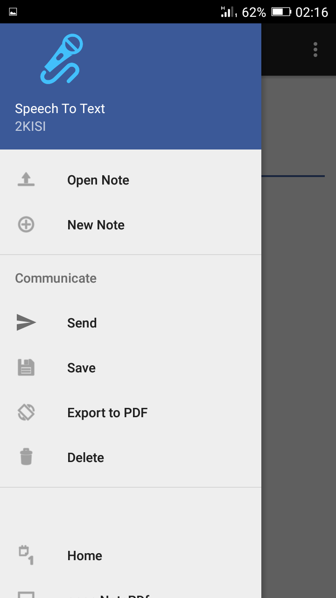
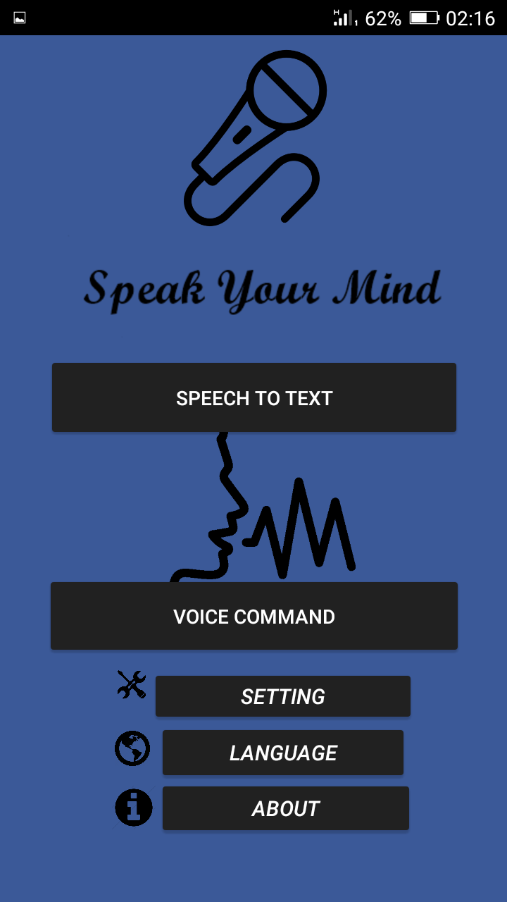
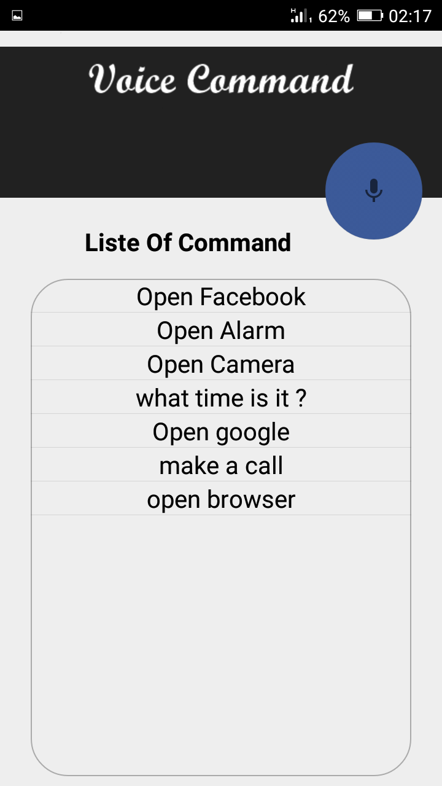
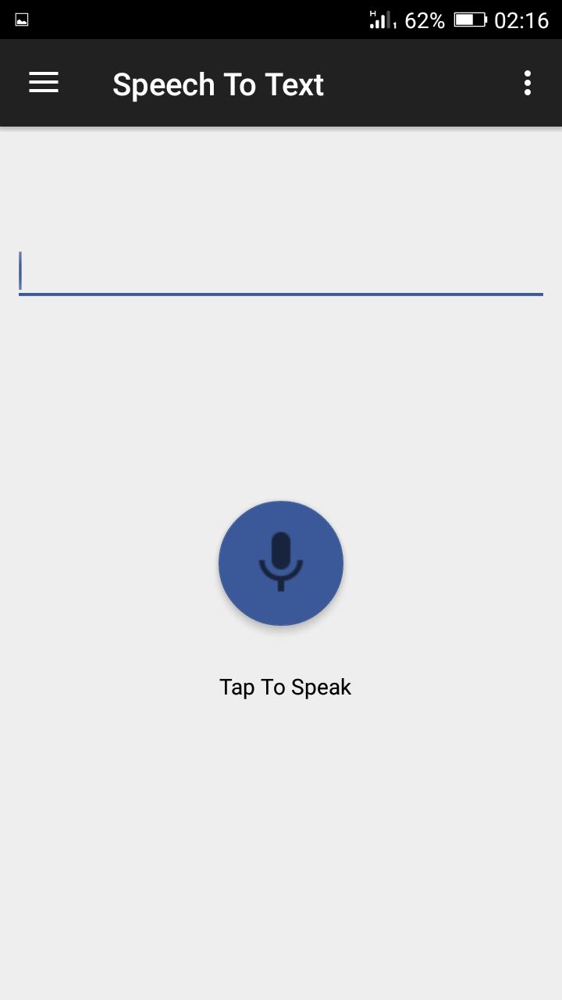

# SpeechToText
je propose de mettre en place une  applications de de reconnaissance automatique de la parole sur une plateforme mobile 
L’application mobile permettant de : 
 La transcription automatique de la parole en texte à partir d'une dictée vocale. 
 L’exécution des commandes vocales (passer des appels, accès au Facebook, accès au navigateur, accès à la caméra). 
 Fournir La possibilité de modifier, envoyer et sauvegarder le texte transcrit. Et doit être : 
 Utilise le système de reconnaissance automatique de la parole Kaldi. 
 Basée sur une interface mobile simple légère, efficace et compatible. 
 Rapide (temps de connexion, temps de sharing) et fluide (fluidité audio), étant donné le nombre de fonctionnalités importantes.
Elle devra aussi offrir une simplicité d’utilisation et surtout ergonomie d’interface

